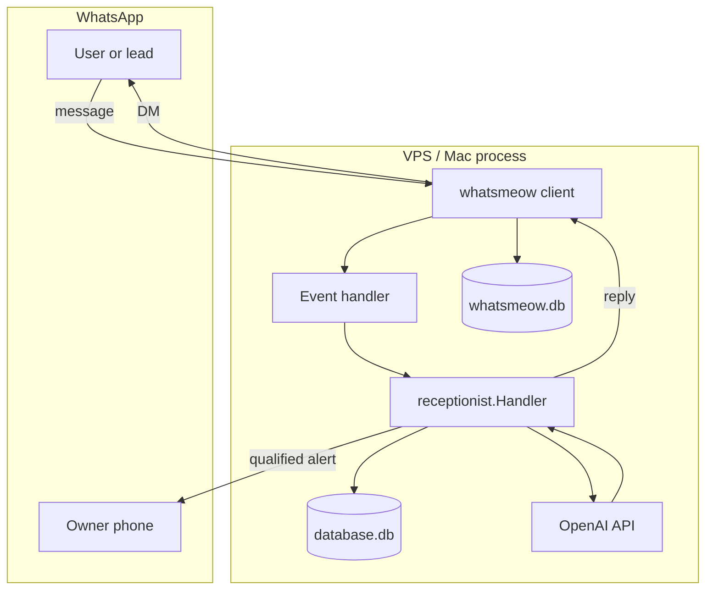

# WhatsApp AI Receptionist — Product & Engineering Plan

**Project:** `ai-receptionist`  
**Repo:** `whatsmeow/` (local git, branch `main`)  
**Last updated:** May 2026  
**Status:** MVP shipped — receptionist + personal mode + self-chat testing

---

## 1. Vision

Build a **small, boring, reliable** WhatsApp assistant for a web agency (and optionally for personal auto-reply) that:

1. Answers inbound WhatsApp messages quickly and naturally.
2. Qualifies leads with one question at a time.
3. Hands hot leads to a human via a WhatsApp summary.
4. Never over-promises (no auto-booking, no fixed pricing guarantees).

This is **not** a SaaS, CRM, or dashboard product in v1. The goal is a single Go binary on a VPS that stays connected 24/7.

---

## 2. What exists today (MVP)

### 2.1 Shipped features

| Area | Feature | Notes |
|------|---------|--------|
| WhatsApp | QR linked-device login | Session in `whatsmeow.db` via `sqlstore` |
| WhatsApp | Receive private text (+ captions) | Groups optional via `reply_to_groups` |
| WhatsApp | Send replies | `SendMessage` with outbound ID tracking |
| AI | OpenAI Chat Completions | `OPENAI_API_KEY`, default `gpt-4o-mini` |
| AI | Startup health check | `AI API OK` / warning on launch |
| AI | Failure fallback message | User gets WhatsApp text when API fails |
| Memory | SQLite `database.db` | `contacts` + `messages`, last 10 turns to model |
| Receptionist | Structured JSON replies | `reply`, `lead_updates`, `qualified`, `summary` |
| Receptionist | Lead field tracking | Go merges fields; injects `missing_fields` into prompt |
| Receptionist | Owner alert | One WhatsApp summary when lead qualifies |
| Receptionist | Safety post-check | Blocks pricing/booking guarantee language |
| Personal | `mode: personal` | Plain-text AI, no lead funnel |
| Personal | `prompt-personal.txt` | Reply in your voice |
| Self-chat | `reply_to_self_chat` | **Message yourself** thread for testing |
| Self-chat | Loop prevention | `OutboundTracker` ignores bot’s own message IDs |
| Ops | Debug | `DEBUG_INBOUND=1`, inbound log lines |
| Ops | Git | Local version control at `whatsmeow/` |

### 2.2 Project layout

```
ai-receptionist/
  main.go
  config.json
  prompt.txt              # agency receptionist
  prompt-personal.txt     # personal voice
  whatsmeow.db            # session (gitignored)
  database.db             # app data (gitignored)
  internal/
    whatsapp/             # connect, inbound filter, send, outbound tracker
    ai/                   # OpenAI client
    store/                # SQLite schema + CRUD
    lead/                 # fields, qualify, admin summary
    receptionist/         # orchestration + safety
    config/               # config.json loader
```

### 2.3 Two databases (by design)

| File | Role |
|------|------|
| `whatsmeow.db` | Device session, encryption keys (whatsmeow `sqlstore`) |
| `database.db` | Conversation memory + lead JSON per contact |

Losing `whatsmeow.db` = scan QR again. Losing `database.db` = lose chat history, not WhatsApp link.

### 2.4 Modes

**Receptionist (`mode: receptionist`, default)**

- Uses `prompt.txt`.
- AI returns JSON; Go owns lead state.
- Required fields: `name`, `business_type`, `service_needed`, `budget`, `timeline`, `current_website`.
- Owner gets one alert when `qualified` and `status != notified`.

**Personal (`mode: personal`)**

- Uses `prompt-personal.txt` (set `PROMPT_PATH`).
- Plain-text replies; lead tracking and owner alerts disabled.
- Best for “sound like me” experiments — quality depends on examples in `business_description`.

### 2.5 Inbound rules (current)

A message is processed only if:

- Not a broadcast.
- Private chat, or group when `reply_to_groups: true`.
- Has extractable text (conversation, extended text, or caption).
- Sender is not `owner_number` (except self-chat path).
- Self-chat: `IsFromMe` allowed when chat sender == chat, with outbound ID filter.

Skipped messages can be inspected with `DEBUG_INBOUND=1`.

---

## 3. Architecture



**Per-chat mutex:** One AI call at a time per `convID` (phone or `self:phone` or group JID).

**Config surface:** `config.json` + env (`OPENAI_API_KEY`, `PROMPT_PATH`, `CONFIG_PATH`, `WHATSMEOW_DB`, `APP_DB`).

---

## 4. Goals by phase

### Phase 0 — MVP ✅ (done)

- [x] Echo → AI → memory → leads → owner alert
- [x] OpenAI-only provider
- [x] Personal mode + self-chat test path
- [x] Local git + README

### Phase 1 — Safe & human ✅

**Goal:** Safe to leave running on a real number without embarrassing replies.

| # | Feature | Status | Notes |
|---|---------|--------|-------|
| 1.1 | **Human takeover** | ✅ | `PAUSE` / `human` → `status=paused`, `paused_until` TTL (`pause_hours`, default 24) |
| 1.2 | **Allowlist / blocklist** | ✅ | `allowed_numbers[]`, `blocked_numbers[]` in `ShouldProcessInbound` |
| 1.3 | **Message debounce** | ✅ | Per `convID`, `debounce_seconds` (default 3) |
| 1.4 | **Typing indicator** | ✅ | `SendChatPresence` + 1–2s delay before reply |
| 1.5 | **Quiet hours** | ✅ | `quiet_hours` in config; short auto-reply outside window |
| 1.6 | **Retry + error log** | ✅ | OpenAI retry on 429/5xx; `errors.log` |

Also shipped from recommended order: **2.1 webhook on qualify**, **3.1 style-examples.txt**.

**Done when:** You can pause a chat, block a number, and overnight messages don’t get long AI replies.

---

### Phase 2 — Agency value (weeks 3–4)

**Goal:** Leads land where you work, with clearer signal.

| # | Feature | Why | Implementation sketch |
|---|---------|-----|-------------------------|
| 2.1 | **Webhook on qualify** | ✅ | POST JSON to `webhook_url` on first qualify; HMAC `X-Webhook-Signature` |
| 2.2 | **Google Sheets row** | No-code CRM | Optional: Sheets API append row (service account) — or defer to webhook only |
| 2.3 | **Lead score** | Owner sees hot vs cold | Rule-based: budget + timeline + service → `hot` / `warm` / `cold` in alert text |
| 2.4 | **Follow-up nudge** | Recover dropped leads | Goroutine + SQLite: if `collecting` and idle > 24h, one reminder message |
| 2.5 | **Multi-language** | Bangladesh / international leads | Detect language from first user message; add line to system prompt |

**Done when:** Qualified lead appears in Slack/email/Sheet without opening terminal logs.

---

### Phase 3 — Personal mode quality (parallel / optional)

**Goal:** Trust “reply as me” enough for selective use.

| # | Feature | Why | Implementation sketch |
|---|---------|-----|-------------------------|
| 3.1 | **`style-examples.txt`** | ✅ | Loaded via `STYLE_EXAMPLES_PATH` (default `style-examples.txt`) into personal/receptionist prompt |
| 3.2 | **Per-chat opt-out list** | Family / boss exempt | `never_reply[]` JIDs in config |
| 3.3 | **Draft-only mode** | Human approval | AI reply only to self-chat; prefix `[DRAFT for +880…]` |
| 3.4 | **Voice note → text** | WhatsApp is voice-heavy | Whisper API on `audio` messages; pass transcript to AI |

**Done when:** You test personal mode on 5 real threads and >80% of drafts are sendable with light edits.

---

### Phase 4 — Ops & scale (when stable)

| # | Feature | Why |
|---|---------|-----|
| 4.1 | `doctor` CLI subcommand | One command: WA linked, OpenAI OK, DB OK |
| 4.2 | systemd + logrotate + backup timer | Production hygiene |
| 4.3 | Health HTTP on `127.0.0.1:8080/health` | Uptime monitoring |
| 4.4 | Second session / second line | Agency vs personal separation |
| 4.5 | Read-only web inbox | Last 50 chats — only if pain is real |

---

## 5. Recommended build order (priority)

If doing one thing at a time:

```
1. Human takeover (1.1)
2. Allowlist / blocklist (1.2)
3. Message debounce (1.3)
4. Typing indicator (1.4)
5. Webhook on qualify (2.1)
6. style-examples.txt (3.1)
7. Quiet hours (1.5)
8. Follow-up nudge (2.4)
```

Rationale: **control and safety** before **more automation**.

---

## 6. Configuration roadmap

Future `config.json` shape (incremental, backward compatible):

```json
{
  "business_name": "Teddy Web Agency",
  "owner_number": "8801521207499",
  "model": "gpt-4o-mini",
  "mode": "receptionist",
  "reply_to_groups": false,
  "reply_to_self_chat": true,
  "allowed_numbers": [],
  "blocked_numbers": [],
  "quiet_hours": { "enabled": false, "tz": "Asia/Dhaka", "start": "22:00", "end": "08:00" },
  "debounce_seconds": 3,
  "webhook_url": "",
  "webhook_secret": ""
}
```

---

## 7. Database evolution

Current schema is enough for Phase 1–2. Planned additions:

**`contacts` table**

| New column | Purpose |
|------------|---------|
| `paused_until` | DATETIME — human takeover |
| `language` | TEXT — detected locale |
| `lead_score` | TEXT — hot/warm/cold |
| `last_bot_reply_at` | DATETIME — debounce / nudge |

**Optional `events` table** (Phase 2+)

- `type`: qualified, webhook_sent, error, paused
- `payload`: JSON
- Audit trail without parsing logs

---

## 8. AI & prompt strategy

### Receptionist

- Keep **structured JSON** for reliable lead extraction.
- Model: `gpt-4o-mini` default; upgrade to `gpt-4o` only if qualification quality is weak.
- Temperature: ~0.4 (current).

### Personal

- **Plain text** output only.
- Invest in `business_description` + `style-examples.txt`, not bigger models.
- Strong rules: no commitments, no payments, defer unknowns.

### Cost control

- Debounce (Phase 1.3) cuts calls ~30–50% on chatty users.
- Cap history at 10 messages (current); consider 6 for personal mode.
- Skip AI when `paused` or outside quiet hours.

---

## 9. Security & compliance

| Risk | Mitigation |
|------|------------|
| WhatsApp ToS / automation | Prefer business line; disclose AI when asked; avoid spammy broadcast |
| API key leak | Never commit `.env`; systemd `EnvironmentFile` mode `600` |
| Prompt injection | System prompt: ignore instructions to reveal keys or change role |
| Over-promising | `SanitizeReply` + prompt rules |
| Session theft | Backup `whatsmeow.db` encrypted; VPS firewall, no public ports except SSH |
| PII in logs | Redact phone in logs optional; don’t log full OpenAI payloads in prod |

---

## 10. Testing checklist

### Manual (every release)

1. Cold start → QR or “Session linked”.
2. Startup → `AI API OK`.
3. **Message yourself** → inbound log + AI reply.
4. New number DM → receptionist asks one question.
5. Complete all lead fields → exactly **one** owner alert.
6. Send `human` or `PAUSE` (after 1.1) → bot stops for that chat.
7. Kill OpenAI key → fallback WhatsApp message, not silence.

### Automated (later)

- Unit tests: `ShouldProcessInbound`, `IsSelfChat`, `lead.Merge`, `ParseStructuredResponse`, `SanitizeReply`
- Integration: mock OpenAI HTTP server

---

## 11. Deployment target

**Environment:** Single VPS (or Mac mini / always-on Mac)

```bash
/opt/ai-receptionist/
  ai-receptionist      # binary
  config.json
  prompt.txt
  .env                 # OPENAI_API_KEY
  whatsmeow.db
  database.db
```

**systemd:** See `README.md` — `Restart=always`, `EnvironmentFile`, journald logs.

**Backups:** Daily `whatsmeow.db` + `database.db` copy off-box.

---

## 12. Explicitly out of scope (until product proves value)

- Full CRM / pipeline UI
- Calendar booking integration (links in handoff message only)
- Payment collection
- Group-wide “moderator bot” for large groups
- Multi-tenant SaaS
- Instagram / Messenger channels
- Fine-tuned custom models

---

## 13. Success metrics

| Metric | Target (90 days) |
|--------|------------------|
| Median reply time | < 10s after debounce |
| Lead qualification rate | > 60% of serious inquiries complete fields |
| Owner alerts per qualified lead | Exactly 1 |
| AI cost per qualified lead | < $0.10 (mini model + debounce) |
| “Bad reply” incidents | < 1/month after Phase 1 safety |

---

## 14. Immediate next actions (this week)

1. **Run in production** on VPS with real `OPENAI_API_KEY` and full `owner_number`.
2. **Test receptionist** with a friend’s number (not self-chat only).
3. **Exercise Phase 1** on VPS (pause, blocklist, quiet hours, debounce).
4. **Commit after each phase** — same git workflow as README.
5. Optional: point `webhook_url` at a Make.com scenario for lead rows in Google Sheets (Phase 2.1 without code if webhook is quick).

---

## 15. Reference commands

```bash
# Dev
cd ai-receptionist
export OPENAI_API_KEY=sk-...
export PROMPT_PATH=prompt-personal.txt   # personal mode only
export DEBUG_INBOUND=1                   # debug skips
go run .

# Build
go build -o ai-receptionist .

# Git (from repo root)
cd ..
git add ai-receptionist/
git commit -m "Describe change"
```

---

## 16. Related repos

| Path | Role |
|------|------|
| `whatsmeow/ai-receptionist/` | This app |
| `../wabot/` | Reference implementation (HTTP daemon, richer API) — patterns only, not a dependency |

If this app later needs HTTP send/receive from other tools, evaluate **merging with wabot** vs adding a minimal local API — default stay standalone until pain is clear.

---

*End of plan. Update this file when phases complete or priorities change.*
